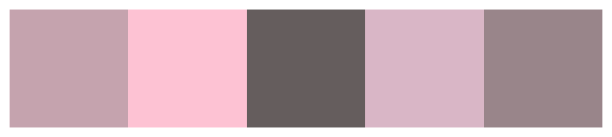

### Paleta de Cores

| Cor           | Hexadecimal | Exemplo                            |
|---------------|-------------|-------------------------------------|
| Rosa pálido   | #C5A3AE     |  |
| Rosa claro    | #FDC2D3     |  |
| Cinza escuro  | #655D5D     |  |
| Rosa suave    | #D9B6C6     |  |
| Cinza rosado  | #99858A     |  |

Referência: 