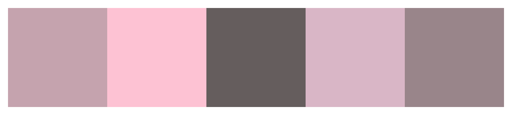

# 🧁 Projeto Delicias da Lu com PHP

Este repositório é destinado a sistemas e projetos em desenvolvimento que envolvem o tema de loja e produtos alimentícios como salgados e doces de festa como brigadeiros e em diante.
Este projeto será construido utilizando PHP, SQL, HTML e CSS.

### logotipo

### Paleta de Cores

### Como ver o projeto de PHP na minha máquina local ?

    1 Inicie o XAMPP na sua máquina após fazer o download do projeto;
    2 No XAMPP, abra a pasta explorar á direita da aplicação;
    3 Ao abrir o explorer selecione s a pasta htdocs;
    4 Extraia o arquivo do projeto dentro da pasta htocs;
    5 No navegador, digite "localhost/" e complete com a pasta onde se localiza o projeto

### Composição
O projeto estará organizado com o padrão MVC (Model, View e Controller) onde na pasta **Model** localizarão-se as referências e integrações com o banco de dados, na pasta **View** encontrarão-se os arquivoes que compõem os detalhes visuais quanto ao sistema e , por fim, na pasta **controller** estarão as regras de negócio do sistema e suas respectivas funcionalidades.

### Autores

Os autores são os respnsáveis e participantes do projeto, no projeto mais recente, desenvolvido com PHP, somos 4 estudantes de sistemas de informação e análise e desenvolvimento de sistemas no 4° semestre pelo UniProjeção Taguantinga Norte.

- [Thiago Silva](https://github.com/CrowvenTh)
- [Roney Vila](https://github.com/akirar0n)
- [Yago](https://github.com/Yago-LDT)
- Bryan 

--- 